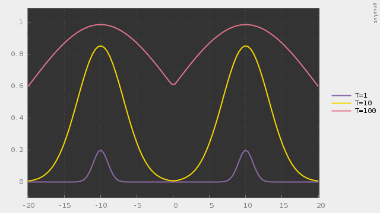
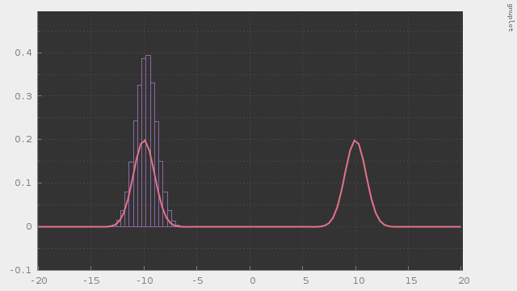
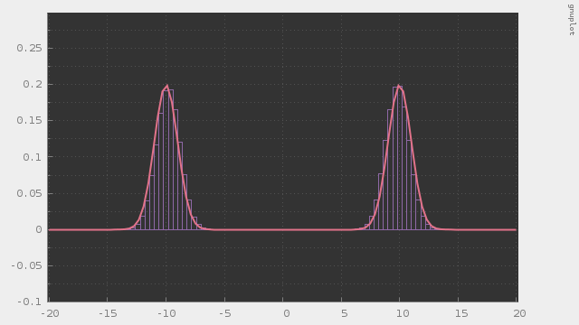
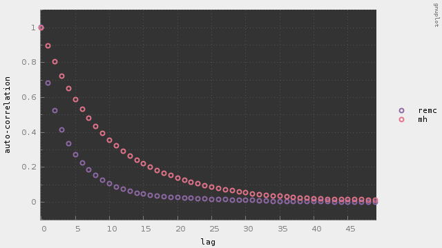

# remc

Replica Exchange Monte Carlo method (Parallel-Tempering)

---

#### これは何？

レプリカ交換モンテカルロ法（パラレルテンパリング）のC++によるフルスクラッチです。

混合ガウス分布のように多峰性のある分布に従う乱数をMCMCで発生させたい場合、通常のランダムウォークMH法では確率分布の低い場所を渡ることができず、どこか特定の峰に囚われて脱出できなくなってしまうことがあります。レプリカ交換モンテカルロ法は、逆温度の異なる複数の分布で独立にMCMCを行い、定期的に詳細釣り合いを満たすように系を交換することで、温度の高い系を経由して別の峰に移動することを可能にするアルゴリズムです。

##### 動作サンプル

このように逆温度の異なる事後分布のカーネルを複数用意します。温度の低い系では中央付近の事後確率が0に近いためランダムウォークでは渡ることができません。温度の高い系では全体的になだらかになっているため渡ることができます。正規化定数は打ち消し合うため無視します。

通常のランダムウォークMH法で混合ガウス分布に従う乱数を発生させた例です。多峰性のある分布の場合、通常のランダムウォークMH法ではこのように片方の峰に囚われて他の峰に辿り着けない場合があります。

レプリカ交換モンテカルロ法で混合ガウス分布に従う乱数を発生させた例です。逆温度の概念を導入することで、温度の高い分布を経由して他の峰に到達することができるようになります。

あとでかく
通常のランダムウォーク法では同じ峰に囚われ続ける傾向があるためこのように自己相関が高くなってしまいますが、

あとでかく
レプリカ交換モンテカルロ法では自己相関を低く抑えることができます。

